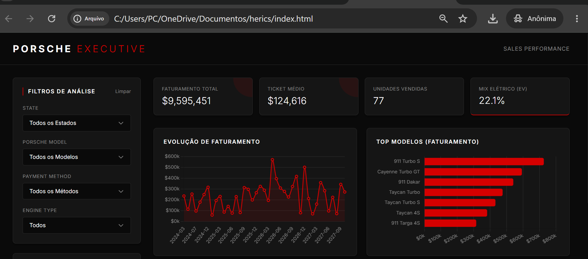
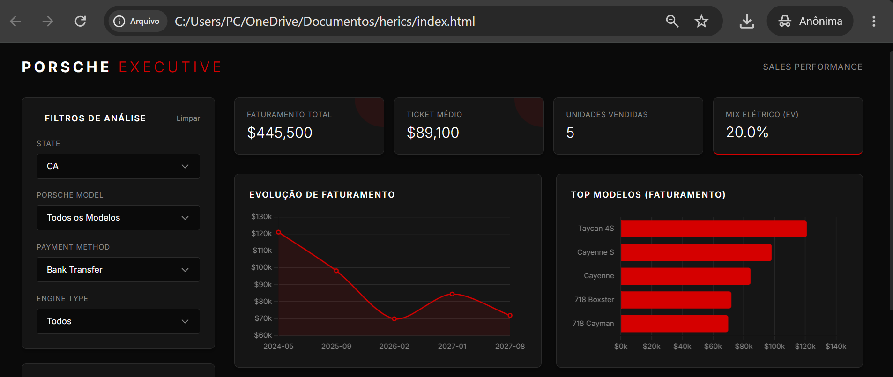

# Dashboard de Vendas Executivo - Porsche (Projeto DIO)

Este projeto é a entrega final do desafio de criação de um dashboard interativo utilizando Inteligência Artificial, desenvolvido para o bootcamp da Digital Innovation One (DIO).

## 🔗 Link do Projeto
**Acesse o dashboard interativo rodando ao vivo aqui:** 
[https://hericamerica.github.io/dashboard-porsche-dio/](https://hericamerica.github.io/dashboard-porsche-dio/)

## 📌 Telas do Dashboard
**Visão Geral (Sem filtros):**

**Visão com Filtros Aplicados (Exemplo de IA responsiva):**

## ❓ Perguntas de Negócio Escolhidas
Para este projeto, em vez de focar em métricas operacionais, adotei uma visão executiva voltada para o mercado de luxo automotivo. As perguntas/KPIs escolhidos foram:

1. **Qual é o Ticket Médio de Venda?** 
   * *Por quê:* No mercado de luxo, o preço médio por cliente é o indicador mais vital para medir o poder de compra do público e a verdadeira saúde financeira da marca.
2. **Qual a proporção de vendas de Veículos 100% Elétricos vs. Combustão/Híbridos?**
   * *Por quê:* A adoção da transição energética é a métrica estratégica mais importante da Porsche globalmente na atual década (ex: adoção do Taycan e Macan Electric).
3. **Qual é o volume de faturamento distribuído por Estado (Geografia)?**
   * *Por quê:* Uma visão macro por estado (em vez de cidades fragmentadas) permite direcionar orçamentos de marketing e a logística de distribuição para as regiões mais rentáveis.
4. **Qual é a Evolução da Receita ao Longo do Tempo?**
   * *Por quê:* Indispensável para identificar tendências de crescimento, sazonalidade e eventuais picos ou quebras no faturamento mensal.

## 🛠️ O Prompt Utilizado e sua Evolução
* **Versão Inicial:** A primeira solicitação foi para gerar uma dashboard em HTML/JS com filtros básicos (Modelo, Ano, Cidade, Pagamento) e perguntas operacionais ("quais modelos mais vendidos por cidade", "qual ano mais saiu").
* **O Refinamento:** Percebi que a visão estava muito operacional para uma marca de alto padrão. O prompt foi evoluído orientando a IA a atuar como um analista executivo. Pedi as seguintes mudanças estruturais:
  * "Troque o filtro e gráfico de Cidade por Estado para uma análise macro mais limpa."
  * "Altere o KPI de modelos mais vendidos para faturamento e Ticket Médio."
  * "Traga de volta um gráfico de tendência temporal (linha do tempo evolutiva)."
  * "Adicione um indicador estratégico específico da Porsche: a taxa de adoção de veículos elétricos (Taycan/Macan Electric)."

## 🧹 Tratamento da Base de Dados
A base de dados original (planilha Excel) passou por processamento antes de alimentar a interface do usuário:
1. **Higienização de Datas:** Conversão e tratamento de datas inválidas (ex: '2024-02-30' e 'INVALID') utilizando bibliotecas de manipulação de dados, removendo valores nulos.
2. **Feature Engineering (Classificação de Motores):** Criação de uma nova coluna lógica separando os modelos entre 'Elétricos' e 'Combustão/Híbrido' para viabilizar o gráfico de transição energética.
3. **Formatação Time Series:** Conversão da coluna de data para o formato Ano/Mês (`YYYY-MM`) para a plotagem correta do gráfico de evolução de receita.
4. **Exportação Segura (JSON):** O DataFrame sumarizado foi convertido para uma estrutura JSON leve, segura e sem dados sensíveis, sendo embutida diretamente no código JavaScript do frontend para não depender de servidores externos.

## 🤖 Ferramentas e IA Utilizadas
Neste projeto, utilizei o **Gemini da Google**. Explorei dois recursos principais da ferramenta:
1. **Interpretador de Código (Python):** Usado nos bastidores pela IA para ler o arquivo Excel (`.xlsx`), limpar os dados, gerar os cálculos estatísticos e converter a base final para o formato JSON.
2. **Web Code Canvas:** Utilizado para a geração estruturada do código Front-end (HTML, CSS e JavaScript utilizando Chart.js), incluindo a criação de um assistente de "IA Insights" simulado no painel lateral.
